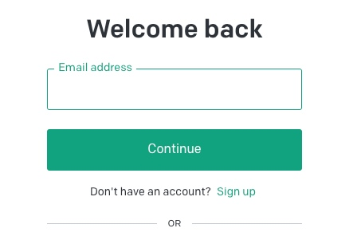

# chatGPT 注册流程

科学上网是前提

## 注册

1. 打开 https://platform.openai.com/

2. 点击 **Sign up**

3. 输入 E-mail 地址，点击 **Continue**；

注：最好使用 Google邮箱或其他国外邮箱，不推荐 qq或163等国内邮箱。

4. 设置密码，点击 **Continue**

若出现：`Signup is currently unavailable, please try again later.` 等错误，需要切换代理线路或更换邮件地址再试

5. 到自己的邮件中查看激活简介

6. 根据表单提示，设置即可；点击 **Continue**

7. 使用境外手机号接收验证码，即可完成注册

8. 注册完毕后，登陆 https://chat.openapi.com 是 GPT 聊天界面
 